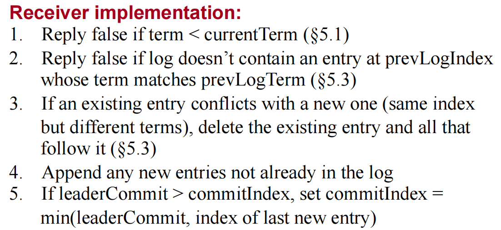

 # Raft
## 结构体/RPC
### AppendEntries
Leader发送的用于**日志同步**或者**心跳检测**的RPC。

### AppendEntriesReply
Peers对于AppendEntries RPC的回复。

## 函数

### Start

> `Start()` should return immediately, without waiting for the log appends to complete.

### sendRequestVote
Candidate向某个peer异步发送投票请求，如果请求成功：ch <- 1，否则：ch <- 0。

### election
进行一次选举的函数。

### RequestVote

响应RequestVote RPC的函数。

#### 原文关键点

* **up-to-date**

    > Raft determines which of two logs is more **up-to-date** by comparing the index and term of the last entries in the logs. If the logs have last entries with different terms, then the log with the later term is more up-to-date. If the logs end with the same term, then whichever log is longer is more up-to-date.

* 

#### 函数流程

* if (currentTerm < term)
  * be Follower(reset currentTerm, reset currentState, reset votedFor)
  * reset electionTimer
  * vote granted
* else if (currentTerm = term)
  * if (currentState = Follower)
    * if (not votedFor anyone or votedFor this one)
      * be/stay Follower(reset currentState, reset votedFor)
      * reset electionTimer
      * vote granted
    * else
      * vote not granted
  * else 
    * vote not granted
* else
  * set reply.Term
  * vote not granted

### AppendEntries
响应AppendEntries RPC的函数。

> While waiting for votes, a candidate may receive an AppendEntries RPC from another server claiming to be leader. If the leader’s term (included in its RPC) is at least as large as the candidate’s current term, then the candidate recognizes the leader as legitimate and returns to follower state. If the term in the RPC is smaller than the candidate’s current term, then the candidate rejects the RPC and continues in candidate state.
* if (currentTerm < term)
  * be Follower(reset currentTerm, reset currentState, reset votedFor)
  * reset electionTimer
* else if (currentTerm = term)
  * if (currentState = Follower and votedFor this peer)
    * reset electionTimer
  * else if (currentState = Candidate)
    * be Follower(reset currentState, reset votedFor)
    * reset electionTimer
* else
  * set reply.Term

### HeartBeat
心跳函数，周期性(heartBeatInterval)调用sendAppendEntries发送AppendEntries RPC

### preVote
预投票，如果一个server无法与其他server通信，那么根据raft协议，该server的term会不断增加。之后，如果该server又重新接入网络，那么就会被选为leader，就会覆盖其他正常server的正常log。

Raft的作者在其博士论文《[CONSENSUS: BRIDGING THEORY AND PRACTICE](http://files.catwell.info/misc/mirror/2014-ongaro-raft-phd.pdf)》9.6节提到了解决方法，即增加preVote环节。

在Pre-Vote算法中，Candidate只有在确认大部分的节点愿意投票后，才会正式增加term并发起投票请求。

## 注意
1. Leader没有election timeout，所以Leader不会主动退出，当收到其他Leader发送的AppendEntries后自动退出。
2. 发送AppendEntries RPC一定要使用子线程（可以用chan进行同步），不然会阻塞在disconnect的peer上。
3. up-to-date：最后一个log的Term大的peer更up-to-date，否则如果term一样，则log长度长的更up-to-date。【问题】：如果某个peer失联了，该peer term很大，恰好又增加了新log，那该peer重新加入后不就会影响系统？