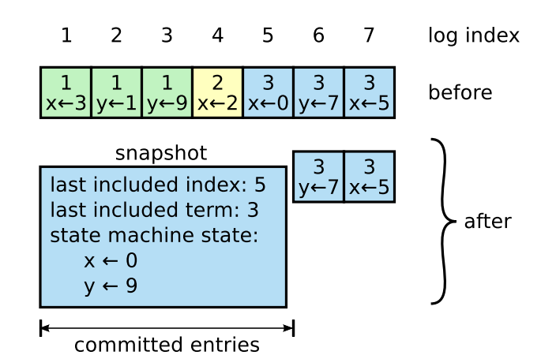
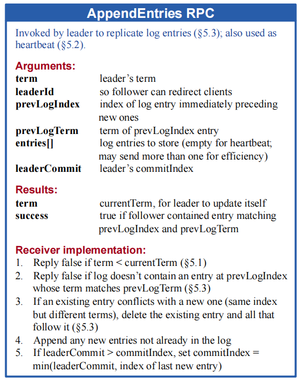

# Raft

## 1.结构体/RPC
### AppendEntries
Leader发送的用于**日志同步**或者**心跳检测**的RPC。

* Term：Leader的当前**任期**；
* LeaderId：Leader的**Id**；
* PrevLogIndex：携带的**Entries**的**前一个Entry的Index**（用于保证日志的准确）；
* PrevLogTerm：PrevLogIndex的**Entry对应的Term**（用于保证日志的准确）；
* Entries：携带的日志，如果没有新增日志可以为空；
* LeaderCommit：Leader当前已经Commit的Entry的Index，用于更新Follower的Commit Index；

### AppendEntriesReply
Peer对于**AppendEntries RPC的回复**。
* ConflictTerm、ConflictIndex: 根据**原论文5.3节**结尾提出的优化策略添加的字段，该字段返回Follower和Leader日志不一致的Index和term，便于Leader重发AppendEntries。

    > If desired, the protocol can be optimized to reduce the number of rejected AppendEntries RPCs. For example, when rejecting an AppendEntries request, the follower can include the term of the conflicting entry and the first index it stores for that term. With this information, the leader can decrement nextIndex to bypass all of the conflicting entries in that term; one AppendEntries RPC will be required for each term with conflicting entries, rather than one RPC per entry. In practice, we doubt this optimization is necessary, since failures happen infrequently and it is unlikely that there will be many inconsistent entries.

### ApplyMsg

所有Peer发送到channel，用于项目的测试（相当于现实中的**State Machine**）。

* CommandValid：是否用于发送Log Entry；
* Command：**已经Commit**的Command，提交Apply；
* CommandIndex：该Command对应的Index；
* SnapshotValid：是否用于发送Snapshot【与CommandValid互斥】；
* Snapshot：Snapshot的数据；
* SnapshotTerm：Snapshot最后一个Entry的Term；
* SnapshotIndex：Snapshot最后一个Entry的Index；

### Snapshot

这个不是**结构体**，是**快照文件的存储结构**。

注意：**Lab2**的Snapshot存储的内容和论文中的不同。

论文中的**Snapshot结构**（第7节）如下图所示，主要包括**last included index**、**last included term**和**state machie state**三个部分。

但由于**Lab2**中的**Snapshot**是测试代码提供的，所以只包括**last included index**和**state machine state**部分，**Lab2**对应的测试代码如下（**config.go/applierSnap**）：

~~~go
if (m.CommandIndex+1)%SnapShotInterval == 0 {
    w := new(bytes.Buffer)
    e := labgob.NewEncoder(w)
    e.Encode(m.CommandIndex) // last included index
    var xlog []interface{}
    for j := 0; j <= m.CommandIndex; j++ {
        xlog = append(xlog, cfg.logs[i][j])
    }
    e.Encode(xlog) // state machine state
    rf.Snapshot(m.CommandIndex, w.Bytes())
}
~~~

### InstallSnapshot

**Leader**发往**Follower**用于**安装快照**的**RPC**。

* Term：Leader当前的任期；
* LeaderId：Leader的ID；
* LastIncludedIndex：该Snapshot的最后一条Entry的Index；
* LastIncludedTerm：LastIncludedIndex对应的Term；
* Offset：Snapshot分块后的偏移【Lab2不用】；
* Data：Snapshot数据；
* Done：Snapshot分块后标识是否是最后一块【Lab2不用】；

### InstallSnapshotReply

**Follower**对于**InstallSnapshot RPC**的回复。

* Term：**Follower**当前任期；

### LogEntry

每条日志记录的结构体。

* Command：指令；
* CommandTerm：该条指令被**Leader**接收时的Term；
* CommandIndex：该条指令被**Leader**接收后存储的Index；

### RequestVoteArgs

选举时，**Candidate**发往**Peer**的投票请求。

* Term：Candidate的Term；
* CandidateId：Candidate的ID；
* LastLogIndex：Candidate**最新日志的Index**；
* LastLogTerm：LastLogIndex对应的Term；

### RequestVoteReply

**Peer**对于**RequestVote** RPC的回复。

* Term：Peer的Term；
* VoteGranted：是否投票；

## 2.函数

### Start

> `Start()` should return immediately, without waiting for the log appends to complete.

评测程序利用该函数进行**日志追加**请求。

如果该server是**Leader**则执行**本地追加**，并返回该条日志的**term、index**等信息；

如果该server是**Follower、Candidate**，则忽略该请求。

### ApplyMsg

单独线程，用于周期性（**applyMsgInterval**）调用（子线程）**sendApplyMsgLog**和**sendApplyMsgSnapshot**发送**ApplyMsg**。

### InstallSnapshot

**Follower**用于安装快照的响应函数。

### GetState

用于测试，返回**当前Term**和**是否是Leader**。

### HeartBeat

Leader的单独线程，心跳函数，周期性(**heartBeatInterval**)调用（子线程）**sendAppendEntries**发送**AppendEntries RPC**。

### sendRequestVote
**Candidate**向某个**Peer**异步发送投票请求，如果请求成功：ch <- 1，否则：ch <- 0。

### election

进行一次选举的函数。

### ticker

单独线程，用于周期性（**electionTimeout / 2**）检查**Follower**和**Candidate**的选举是否超时（**electionTimeout**），超时即开启新的选举（子线程调用**election**）。

### decrementNextIndex

根据**term**回退发送的日志，退到该**term**的第一天日志。

### resetElectionTimeout

重新（随机）设置选举超时时间，**每次超时后**重新设置。

### RequestVote

响应RequestVote RPC的函数。

#### 原文关键点

* **up-to-date**

    > Raft determines which of two logs is more **up-to-date** by comparing the index and term of the last entries in the logs. If the logs have last entries with different terms, then the log with the later term is more up-to-date. If the logs end with the same term, then whichever log is longer is more up-to-date.

### AppendEntries
响应**AppendEntries RPC**的函数，主要进行**日志的追加**。

#### 原文关键点

> 

> While waiting for votes, a candidate may receive an AppendEntries RPC from another server claiming to be leader. If the leader’s term (included in its RPC) is at least as large as the candidate’s current term, then the candidate recognizes the leader as legitimate and returns to follower state. If the term in the RPC is smaller than the candidate’s current term, then the candidate rejects the RPC and continues in candidate state.

#### 实现流程

* 检查term；

* 如果**peer term < leader term**，变为**Follower**（不投票），如果**peer term > leader term**，**返回**追加日志失败以及当前term；
* 检查log；
* 如果**peer term = leader term**，为该Leader投票

### Log

自己封装的**日志函数**，支持**自定义日志等级**（通过**verbose**指定输出日志等级，**0为不输出日志**，1为最高等级日志依次类推）。

### getVerbosity

日志相关，从**环境变量**中获取**VERBOSE**字段，作为输出的日志等级（仅支持Linux系统，参考[Debugging by Pretty Printing (josejg.com)](https://blog.josejg.com/debugging-pretty/)）。

### persist

持久化函数，用于**currentTerm**，**log**，**votedFor**和**snapshot**的持久化。

### readPersist

读取已经持久化的内容。

### preVote【**deprecated**】
**预投票**，如果一个server无法与其他server通信，那么根据raft协议，该server的term会不断增加。之后，如果该server又重新接入网络，那么就会被选为leader，就会覆盖其他正常server的正常log。【注意：根据**Raft**协议，不会覆盖正常log，因为server正常接入后，发送**RPC请求**给其他server，其他server会**更新自身Term**，并转为**Follower**，但并**不立即给这个server投票**，而是将**votedFor置为-1**，只有在后面**确认server的日志up-to-date之后才会投票**】

Raft的作者在其博士论文《[CONSENSUS: BRIDGING THEORY AND PRACTICE](http://files.catwell.info/misc/mirror/2014-ongaro-raft-phd.pdf)》9.6节提到了解决方法，即增加preVote环节。

在Pre-Vote算法中，Candidate只有在确认大部分的节点愿意投票后，才会正式增加term并发起投票请求。

## 3.注意事项【踩坑记录】
1. Leader没有**election timeout**，所以**Leader不会主动退出**。只有收到其他Leader发送的**AppendEntries**（Term大于当前Leader）后会自动退出；

2. 发送**AppendEntries RPC**一定要使用**子线程**（可以**用chan进行同步**），不然会阻塞在**失联**的Peer上；

3. **up-to-date**：最后一个**log的Term大的Peer更up-to-date**；否则，如果term一样，则**log长度长的更up-to-date**。

4. 原文中提到**convert to follower**，只是将**currentState**转为**Follower**，只要把**votedFor**设为**-1**，**不需要为该server投票**。

5. **Figure 8[不能提交小于currentTerm的log]**

    Raft论文在Figure 8(下图)介绍了原因：
    

    ​	(a). S1是term(2)的Leader[S2,S3,S4,S5投票]，但在写完S1和S2的log后就挂了；

    ​	(b). S5是term(3)的Leader[S3,S4投票]，但在写完S5的log后就挂了；

    ​	(c). 【错误情况】S1是term(4)的Leader[S2,S3,S4投票]，在复制并commit term(2)的log【小于当前term】，以及写完S1的term(4)log后挂了；

    ​	(d). 【错误情况】此时S5是term(5)Leader[S2,S3,S4投票]，复制并commit term(3)的log【等于当前term】；
    cd出现的问题是**index(2) commit了两次log，分别是term(2)和term(3)**，这违背了**Raft**基本假设。

    ​	(e). 【正常情况】c中的Leader commit term(4)【当前term】的日志。

    

6. Follower的**AppendEntries RPC**响应中：不要直接用切片的方式**追加所有的日志**，因为由于网络问题**网络包的到达顺序可能不同**（例如：append index=34的包可能比append index=33的包先到达），这样有可能**not up-to-date的日志会覆盖掉up-to-date的日志**；

7. Follower的**AppendEntries RPC**响应中：在追加日志时，有些Follower日志中最后的CommandTerm < Leader日志的最后CommandTerm，需要直接追加所有的entries；

8. Follower的**AppendEntries RPC**响应中：如果发现**冲突entry，需要删除该entry以及之后的所有entry**；

9. election中，Candidate收到RequestVote Reply后要**确认Term没有发生改变**（在发送RequestVote到收到Reply这段时间，Term可能发生改变）后才可以变为Leader；

10. **mutex**和**channel**一起使用可能会造成死锁问题。【TODO】

    ~~~go
    for a <- ch {
        b.Lock()
        // do something
        b.Unlock()
    }
    
    
    /////////////////////////////////////////
    b.Lock()
    a <- 7
    b.Unlock()
    
    ~~~

    

11. **nextIndex**和**matchIndex**区别：nextIndex主要记录向Follower发送日志的Index，matchIndex记录Follower已经存在的Index，大部分情况下nextIndex=matchIndex+1，但某些情况下不是（例如，初始情况下nextIndex等于最后一条Entry的Index，matchIndex=0）；

12. **func (rf *Raft) Snapshot(index int, snapshot []byte) {}**函数中，index表示快照的**最新一条Entry的Index**，snapshot是快照内容，不需要我们自己生成快照；

13. **AppendEntries RPC**中，在**Follower返回成功**的情况下，Leader保存的**nextIndex**和**matchIndex**数组必须保证增长，每次更新前需要**检查新值大于当前值**。因为由于网络原因后发的RPC可能比先发的RPC先到达；

14. Follower的AppendEntries RPC响应中：只有在**log长度小于PrevLogIndex时才回复ConflictIndex**，按照ConflictIndex回退；其他情况（包括日志冲突）都回复ConflictTerm，按照term回退；

15. Leader的**decrementNextIndex**中，判断条件需要是*rf.log[i].CommandTerm == conflictTerm-1*， 不能是*rf.log[i].CommandTerm < conflictTerm*，因为有可能Follower的log term大于Leader，这样每次只能回退一条log，影响日志同步效率；

16. Follower的**InstallSnapshot RPC**响应【InstallSnapshot 函数】中，仅要求当前snapshot的**lastIncludedIndex不大于Leader的lastIncludeIndex**【即，rf.lastIncludedIndex <= args.LastIncludedIndex】。因为官方测试代码中的snapshot仅包括**last included index**和**state machine state**，不包括**last included term**，这就导致在某个peer**crash**重启后其**last included term**被置为0，需要重新获取该term的**snapshot**；

17. 各个Peer的**初始化**：**选举超时计时器一定设为从当前开始计时**【即，electionTimer=time.Now().UnixMilli()】，这样**避免Peer一连接到网络就开始选举**（很可能当前集群中已经存在Leader，会有很大的性能改进）；

18. 【性能优化】**election timeout**的值初始化时，可以设置小一点（相对于过程重设时的），这样当集群启动时可以更快地发起第一轮选举；

19. **Snapshot**的内容（无论是**Leader**还是**Follower**上的）可以认为是**永远正确**，只有是否**up-to-date**的区别。因为只有当**大于一半的Peer提交了该请求**，该请求才会生成**Snapshot**，所以生成**Snapshot**内容的**log**是正确的（换个角度说，如果Snapshot有错误，那么**Crash**后就会出错）。根据上述结论，在**Follower**响应**AppendEntries RPC**的函数中，对于**Leader**发送的在**Follower**的**lastIncludedIndex**之前的**Log**直接返回**Success**（即：reply.Success=1）即可。

20. 接上一条，当**Snapshot**的**last included term**和**AppendEntries**的**term**冲突时，我们需要重新获取**Snapshot**，但是不需要删除**last included entry**之后的内容，因为**Snapshot**内容必为正确的，只是由于重新启动导致**trem=0**；

21. 接上两条和**16条**，由于**Snapshot**内容可以认为是**永远正确**的，所以测试中不包括**last included term**是可以的，因为所有操作中**不需要比较last included term**；

## 4.测试

## 5.问题
[常见问题](https://thesquareplanet.com/blog/students-guide-to-raft/)

1. 如果某个peer**失联**了，该peer的**term很大**，恰好又**增加了新log**，那该peer重新加入后不就会**被选为Leader**，从而**覆盖掉**其他peer的正确log？

   个人理解：如果失联的peer是Follower，那么该Follower不会成为Leader，所以无法追加日志；如果该peer是Leader，失联后该Leader的term不会增加，相反其他Follower的term会增加从而选出新的Leader。

